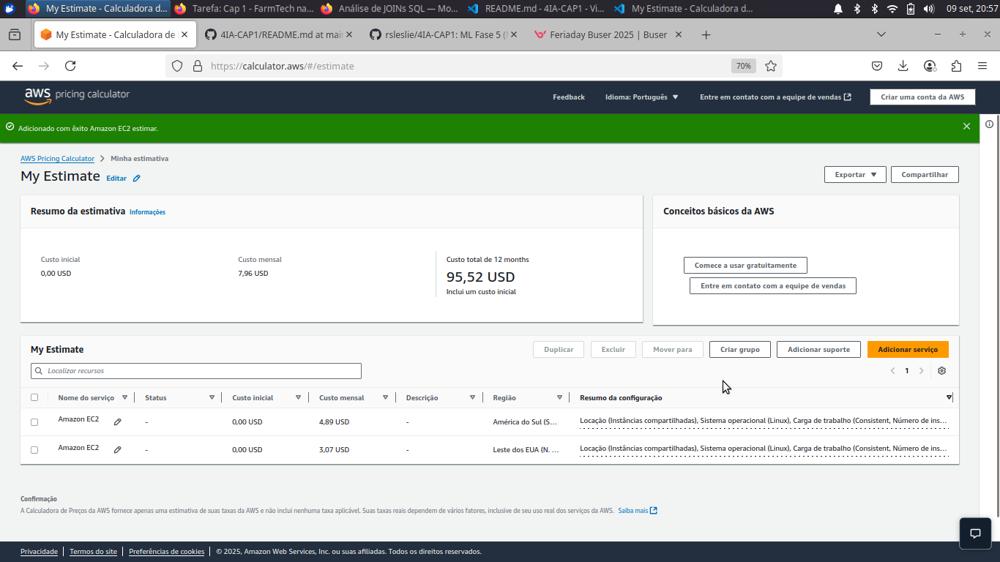

# Estimativa de Custos – Entrega 2

## 1. Contexto
Este documento apresenta a estimativa de custos para hospedar a Machine Learning da Entrega 1 em uma instância EC2 na AWS.

**Requisitos da instância:**
- 2 vCPUs  
- 1 GiB de memória RAM  
- Até 5 Gbps de rede  
- 50 GB de armazenamento (EBS)  
- Uso constante (100% do tempo)  

---

## 2. Comparação de Custos entre Regiões

| Região                        | Tipo de Instância | Custo Mensal (USD) | Total 12 Meses (USD) |
|-------------------------------|-----------------|------------------|--------------------|
| América do Sul (São Paulo)    | t4g.micro       | 4.89             | 58.69              |
| Leste dos EUA (N. da Virgínia)| t4g.micro       | 3.07             | 36.79              |

\* Valores considerando **Compute Savings Plans 3 anos – No Upfront**.  

---

## 3. Observações
- Todos os valores são **estimativas da Calculadora de Preços da AWS**.  
- Custos reais podem variar de acordo com uso efetivo e taxas adicionais.  
- O custo inicial incluído é **0,7 USD** na estimativa.  

---

## 4. Justificativa da Escolha
Apesar de a região da Virgínia do Norte apresentar custo menor, escolhemos **São Paulo (BR)** por:  
1. **Acesso rápido aos dados** dos sensores instalados na fazenda.  
2. **Restrições legais** que impedem armazenar dados sensíveis no exterior.  
3. **Baixa latência**, garantindo performance da API.  

---

## 5. Conclusão
A instância **t4g.micro** atende aos requisitos mínimos e é suficiente para hospedar a API de Machine Learning de forma econômica e eficiente.

---

## 6. Referências Visuais

Abaixo está a captura de tela da estimativa de custos na AWS:




# Entrega 1

## Descrição do Projeto
Este projeto tem como objetivo analisar dados agrícolas de uma fazenda de médio porte, aplicando técnicas de **Machine Learning** e **Análise Exploratória de Dados** para prever o rendimento das culturas. As atividades principais incluem:

1. Exploração dos dados para identificar padrões e tendências.
2. Clusterização das observações para detectar grupos similares e possíveis outliers.
3. Treinamento e avaliação de cinco modelos de regressão supervisionada:
   - Regressão Linear
   - Decision Tree Regressor
   - Random Forest Regressor
   - Gradient Boosting Regressor
   - Support Vector Regressor (SVR)
4. Comparação do desempenho dos modelos utilizando métricas `RMSE`, `MAE` e `R²`.
5. Documentação das conclusões sobre o desempenho dos modelos, tendências encontradas e limitações.

O dataset utilizado contém as seguintes variáveis:
- `Crop`: tipo de cultura
- `Precipitation (mm day-1)`: quantidade de chuva diária em mm
- `Specific Humidity at 2 Meters (g/kg)`: umidade específica a 2 metros
- `Relative Humidity at 2 Meters (%)`: umidade relativa a 2 metros
- `Temperature at 2 Meters (C)`: temperatura em °C a 2 metros
- `Yield`: rendimento em toneladas por hectare

---

## Estrutura do Repositório
- `RannaLeslieConceiçãoSilva_rm562685_pbl_fase4.ipynb`: Notebook Jupyter contendo todo o código do projeto
- `crop_yield.csv`: Dataset utilizado (se necessário)
- `README.md`: Documentação introdutória do projeto
- 
---

## Resultados e Insights
- **Clusterização:** identificamos 3 clusters distintos de culturas com base nas variáveis climáticas e de rendimento. O Silhouette Score foi 0.298, indicando separação moderada entre os grupos.  
  - Cluster 0: 31 observações  
  - Cluster 1: 68 observações  
  - Cluster 2: 57 observações  

- **Modelos de Regressão:**  
  - O modelo com melhor desempenho foi o **Random Forest Regressor** com R² mais alto.  
  - Modelos como SVR e Gradient Boosting também apresentaram bom desempenho, mas com variação maior nos erros `RMSE` e `MAE`.  

- **Tendências identificadas:**  
  - Culturas como cacau apresentaram rendimento mais consistente em determinadas faixas de temperatura e umidade.  
  - Outliers foram identificados em rendimentos extremos, principalmente devido a variações climáticas fora da média.

- **Limitações:**  
  - O dataset é relativamente pequeno (156 observações), podendo impactar a generalização dos modelos.  
  - Fatores como fertilização do solo ou pragas não foram considerados.  

---

## Como Executar
1. Clone este repositório:
```bash
git clone https://github.com/rsleslie/4IA-CAP1.git
